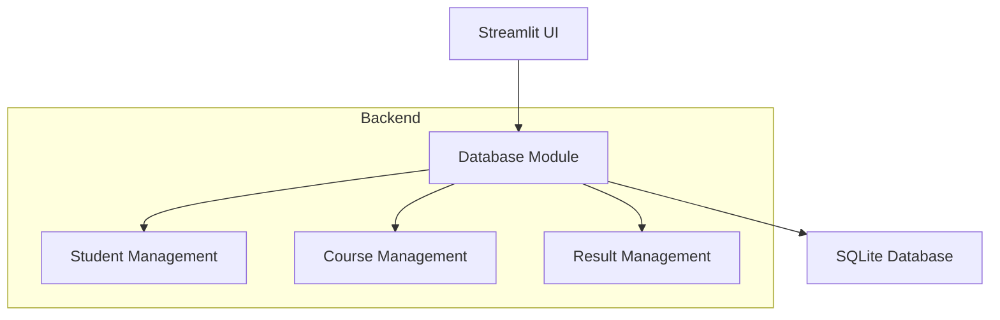
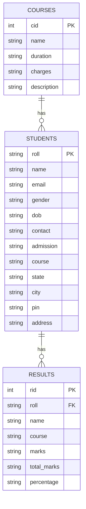

# 🎓 **Academia Hub** - Student Management System  

A **Streamlit-based** application for managing **students, courses, and results** with a **SQLite** backend.  

    

---

## 📌 **Table of Contents**  
1. [Features](#-features)  
2. [System Architecture](#-system-architecture)  
3. [Database Schema](#-database-schema)  
4. [Installation](#-installation)  
5. [Usage](#-usage)  

---

## 🚀 **Features**  

| Feature | Description |
|---------|-------------|
| **📚 Course Management** | Add, update, delete, and search courses |
| **👨‍🎓 Student Management** | Manage student records with personal & academic details |
| **📝 Result Management** | Record and analyze student performance |
| **📊 Reports & Analytics** | View student results and statistics |
| **🔍 Search Functionality** | Quickly find students or courses |
| **🔄 CRUD Operations** | Full Create, Read, Update, Delete support |

---

## 🏗 **System Architecture**  



### **How It Works**  
1. **Frontend**: Built with **Streamlit** (Python-based web framework).  
2. **Backend**: Uses **SQLite** for data storage.  
3. **Thread-Safe DB Connections**: Each thread maintains its own connection.  

---

## 🗃 **Database Schema**  

### **Tables Structure**  



---

## ⚙ **Installation**  

### **Prerequisites**  
- Python 3.8+  
- `pip` package manager  

### **Steps**  
1. Clone the repository:  
   ```bash
   git clone https://github.com/yourusername/academia-hub.git
   cd academia-hub
   ```
2. Install dependencies:  
   ```bash
   pip install -r requirements.txt
   ```
3. Run the app:  
   ```bash
   streamlit run main.py
   ```
---

## 🖥 **Usage**  

| Tab | Functionality |
|-----|--------------|
| **📊 Dashboard** | Overview of students, courses, and results |
| **📚 Courses** | Manage course details (duration, fees, etc.) |
| **👨‍🎓 Students** | Add/edit student profiles |
| **📝 Results** | Record exam scores & calculate percentages |
| **📋 Reports** | View student performance |

---

## 🔗 **Live Demo**  
👉 [Try Academia Hub on Streamlit Cloud](https://your-streamlit-app-link.streamlit.app/)  

---

**🎉Built for Efficient Management** 🎉  

---
